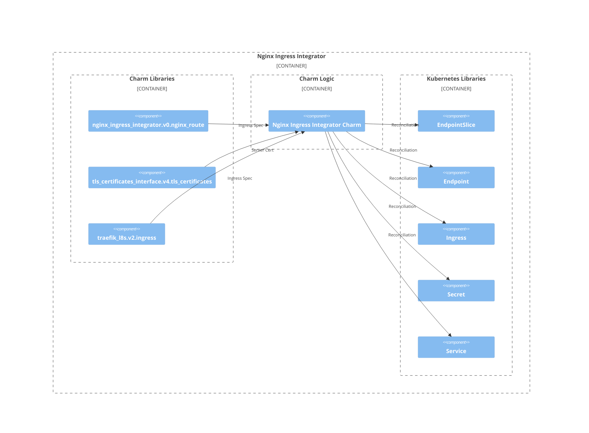

# Charm architecture

At it’s core, Nginx Ingress Integrator is a basic charm that talks to the 
Kubernetes API and provisions an Nginx ingress resource.

In designing this charm, we've leveraged Juju's sidecar pattern for Kubernetes 
charms, but somewhat unusually we're not actually deploying a workload container
alongside our charm code. Instead, the charm code is talking directly to the 
Kubernetes API to provision the appropriate Nginx ingress resource to enable 
traffic to reach the service in question. 

As a result, if you run a `kubectl get pods` on a namespace named for the Juju 
model you’ve deployed the nginx-ingress-integrator charm into, you’ll see 
something like the following:

```
NAME                             READY   STATUS    RESTARTS   AGE
nginx-ingress-integrator-0       1/1     Running   0          3h47m

```

This shows there is only one container, for the charm code itself.

## Structure of the Nginx ingress integrator

The Nginx Ingress Integrator receives ingress requests from application charms 
via either the [`ingress` integration](https://github.com/canonical/charm-relation-interfaces/tree/main/interfaces/ingress/v2) 
or the [`nginx-route` integration](https://github.com/canonical/charm-relation-interfaces/tree/main/interfaces/nginx_route/v0). 
The `ingress` integration is more prevalent, as it is the same integration 
supported by many other charms, including the [`traefik-k8s` charm](charmhub.io/traefik-k8s). 
The `nginx-route` integration is more specific to the Nginx Ingress Integrator 
but offers more customization of the ingress specification.

When the Nginx Ingress Integrator receives an ingress request via either the 
`ingress` integration or the `nginx-route` integration, it unifies the request
into an intermediate representation and then converts this intermediate 
representation into the desired Kubernetes resources, including [`ingress` resources](https://kubernetes.io/docs/concepts/services-networking/ingress/)
, [`service` resources](https://kubernetes.io/docs/concepts/services-networking/service/)
, [`EndpointSlice` resources](https://kubernetes.io/docs/concepts/services-networking/endpoint-slices/)
, and [`secret` resources](https://kubernetes.io/docs/concepts/configuration/secret/)
, among others. This process creates the ingress needed to route traffic to the 
application charm as requested.

The Nginx Ingress Integrator can also integrate with `tls-certificate` provider 
charms and use the certificates provided by these charms as the server 
certificates for ingress.

## Nginx ingress integrator's handling of `ingress` integration

Since the `ingress` integration is a universal integration that may be used in 
Juju models or Juju Kubernetes models, unlike the `nginx-route` integration, 
which is designed exclusively for use within Juju Kubernetes models, the Nginx
Ingress Integrator cannot make many assumptions about the application requiring
ingress. For this reason, the ingress for `ingress` integrations is built based
on Kubernetes `EndpointSlice` resources, using `IP` addresses provided in the
ingress integration. In contrast, the `nginx-route` integration is based on 
`service` resources with [selectors](https://kubernetes.io/docs/concepts/overview/working-with-objects/labels/).

## Charm architecture diagram

The Nginx Ingress Integrator charm uses the `ingress`, `tls_certificates`, and 
`nginx_route` charm libraries to handle charm integrations. It also uses the 
Kubernetes Python client, which is wrapped in custom modules to reconcile the 
Kubernetes resources necessary for ingress.

